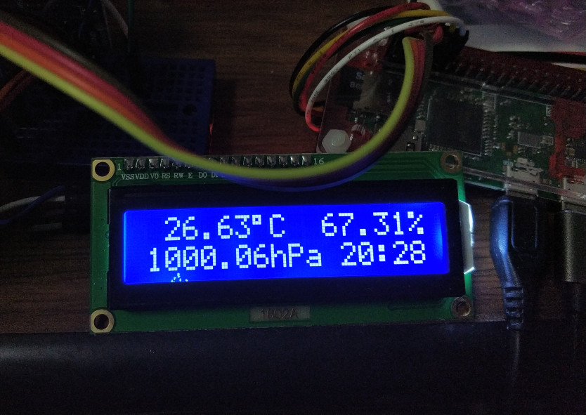

## What is this

PCF8574Tを使った1602ALCDでBME280で取得した値を表示するサンプル。のつもり

## 使い方等

メインプログラムはlcd-bme280.pyです。
bme280_python3.pyと一緒にパスの通った/usr/local/binあたりに

i2clcd-bme280.serviceはsystemdでのサービス登録用です。

/etc/systemd/system/に置いて

systemctl enable l2clcd-be280とでもやれば登録されます。
あとはsystemd start l2clcd-be280で動作するはずです。

## Licence等

色々と参考にしたソースがGPLらしいので全てGPLに準拠

## 動作サンプル

## 参考にした文献やWebページなど

主に参考にしたソース群

https://github.com/gpul-labs/GPUL_RFID/blob/master/LCDScreen/lcd_i2c.py

http://osoyoo.com/driver/i2clcda.py

https://osoyoo.com/ja/2014/12/07/16x2-i2c-liquidcrystal-displaylcd/

https://moyoi-memo.hatenablog.com/entry/2020/03/12/101409

こちらは特殊文字の扱いに役立ちました

https://github.com/dhylands/python_lcd

たぶん一番参考になった

